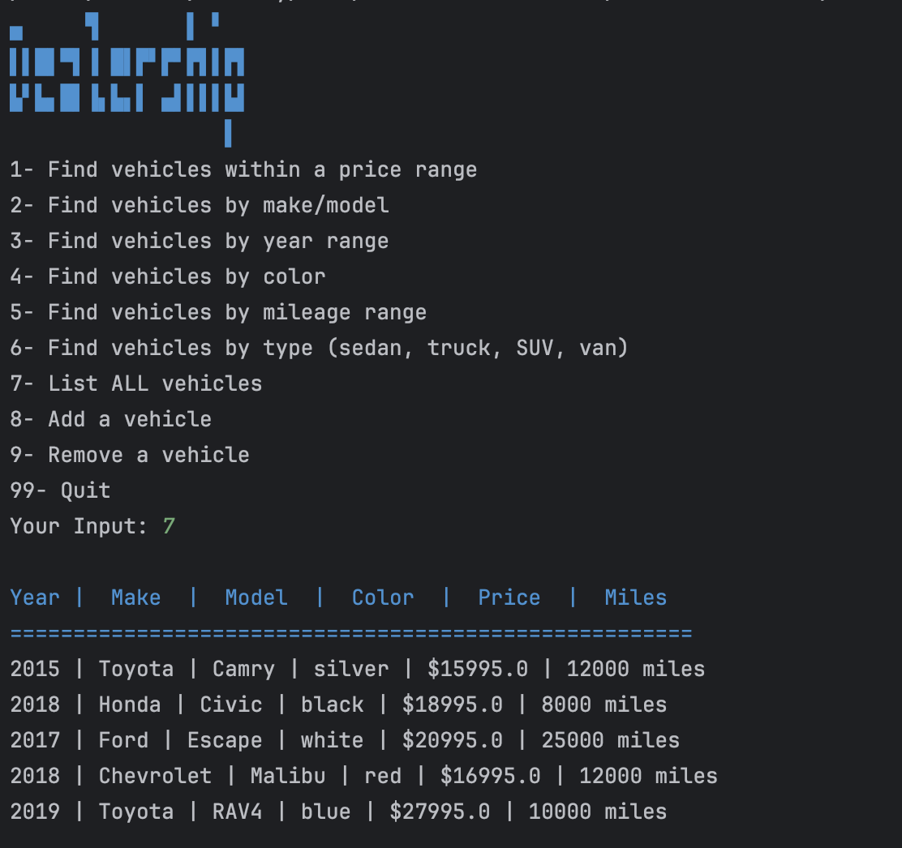
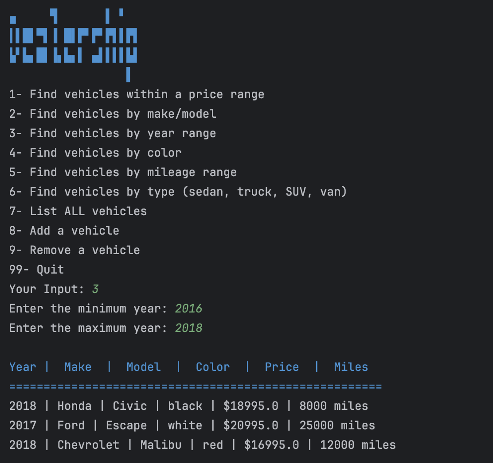
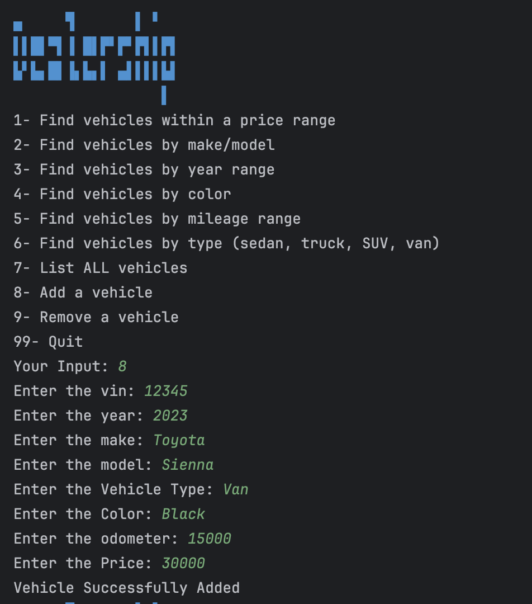
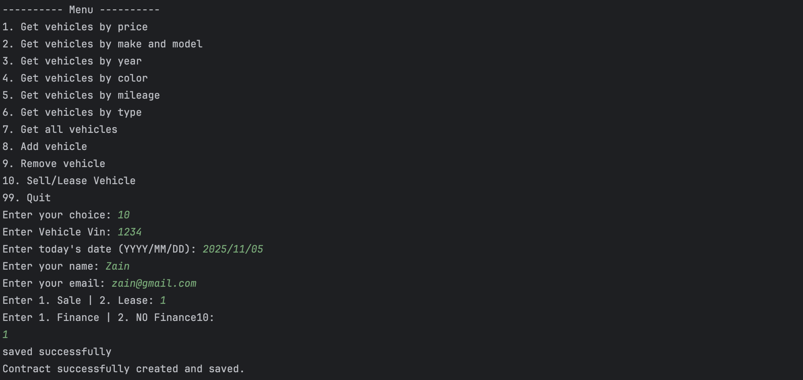

# Car Dealership

## Description of the Project

In this program you are able to view cars, add cars, remove cars, lease cars, finance cars, buy cars and view all the cars.
It saves everything in a text file so the cars will not be lost when you close the application.
## User Stories

- I should, as a user, want the application to be centered from a single main entry point, so that I am able to just run the program.
- I should, as a user, get to view a menu on the screen where I can choose what action to take in the dealership application.
- I should, as a user, get the system to store information regarding vehicles and dealerships, so that my information is structured and can be reused subsequently.
- I should, as a user, I want the system to save and load car information from a file, so that dealership stock is preserved between sessions.
- I should, as a user, want to delete, add, and search for cars, so that I can manage the dealership's stock in a convenient way.
- I should, as a user want to lease or buy a car, also be able to finance a car I am buying.

### Prerequisites

- IntelliJ IDEA: Ensure you have IntelliJ IDEA installed, which you can download from [here](https://www.jetbrains.com/idea/download/).
- Java SDK: Make sure Java SDK is installed and configured in IntelliJ.

### Running the Application in IntelliJ

Follow these steps to get your application running within IntelliJ IDEA:

1. Open IntelliJ IDEA.
2. Select "Open" and navigate to the directory where you cloned or downloaded the project.
3. After the project opens, wait for IntelliJ to index the files and set up the project.
4. Find the main class with the `public static void main(String[] args)` method.
5. Right-click on the file and select 'Run 'YourMainClassName.main()'' to start the application.

## Technologies Used

- Java: 17

# Demo

)
)
)
)

## Resources

- [Potato Sensei](https://chatgpt.com/g/g-681d378b0c90819197b16e49abe384ec-potato-sensei)
- WorkBooks
- [Text to ASCII Art Generator](https://patorjk.com/software/taag/#p=display&f=Big&t=Finance&x=none&v=4&h=4&w=80&we=false)

## Thanks

- Thank you to Raymond  for continuous support and guidance.